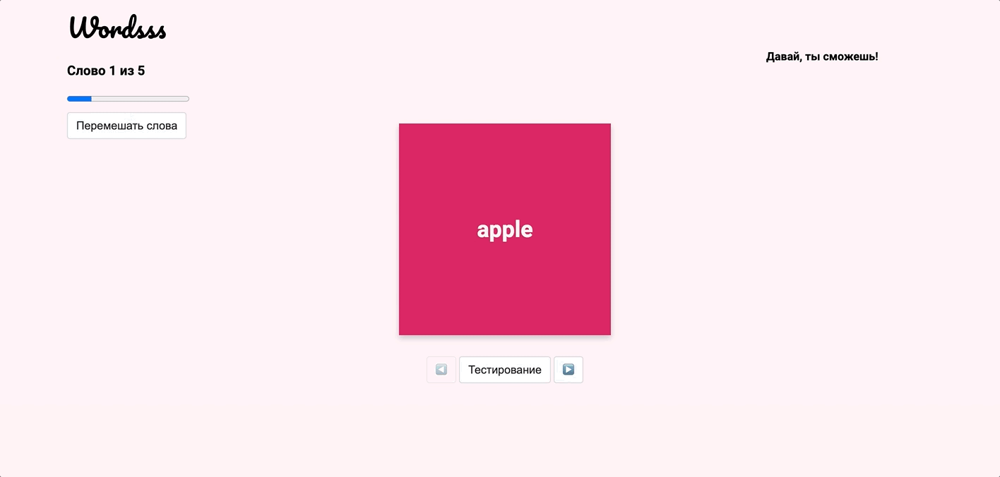

# Итоговый проект "Приложение для изучения иностранных слов"

Теперь ты официально на финишной прямой! В качестве итогового задания тебе предстоит реализовать приложение для изучения иностранных слов.

Покажи на что ты способна!

Традиционно задание включает в себя два уровня сложности: первый обязателен для получения зачета, второй — по желанию.

В `index.html` уже есть все что тебе нужно. Для скрытия-показа элементов в зависимости от режима используй класс `.hidden`. Если хочешь, можешь поменять разметку и стили, чтобы добавить своему проекту уникальности.

Если в ТЗ что-то не прописано, и в демо не показано, реализация на твой вкус 😊

## Обязательный уровень

### Режим тренировки

- По клику переворачиваются карточки (hint: добавь класс `.active` элементу `.flip-card`)
- Карточки на одной стороне (`#card-front`) содержат иностранное слово, а на другой (`#card-back`) — его перевод и пример использования
- С помощью стрелок можно листать карточки вперед-назад, будто слайдер (смотри [демо](https://github.com/CodegirlSchool/foreign-words-training/blob/main/README.md#%D0%B4%D0%B5%D0%BC%D0%BE%D0%BD%D1%81%D1%82%D1%80%D0%B0%D1%86%D0%B8%D1%8F-%D1%80%D0%B0%D0%B1%D0%BE%D1%82%D1%8B-%D0%BE%D0%B1%D0%B0-%D1%83%D1%80%D0%BE%D0%B2%D0%BD%D1%8F))
- Если дошли до границы (к примеру, просматриваем первое или последнее слово), то стрелка вперед (или назад) блокируется
- Отображается номер текущего слова (отсчет обязательно идет с единицы)
- При клике на кнопку «Тестирование» осуществляется переход в режим проверки знаний
- Для скрытия-показа элементов в зависимости от режима используй класс `.hidden`.

### Режим проверки знаний

- Отображаются карточки слов и их переводов (определений) в **случайном** порядке «рубашками вверх»
- Первая и вторая выбранные карточки подсвечиваются при клике
- Первой карточке всегда добавляется класс `.correct`
- Если карточки совпали (слово – перевод), они убираются с поля (добавляй обеим CSS-класс `.fade-out`)
- Если пара подобрана неверно, вторая карточка на секунду подсвечивается красным (класс `.wrong`), и тестирование продолжается
- Где-то через 500ms подсветка с неправильно подобранной пары должна пропасть
- Когда все карточки пропадут с поля, пользователю должно показаться уведомление об успешном завершении проверки знаний (можно обойтись простым `alert`)

## Продвинутый уровень уровень
Можешь добавить все перечисленные возможности интерфейса или лишь некоторые из них.
- Перемешивание карточек случайным образом в режиме тренировки (при клике на кнопку `#shuffle-words`)
- Отображение времени тестирования в режиме проверки знаний (элемент `#timer`)
- Отображение процента просмотренных слов в режиме тренировки (внутри `#study-mode` элемент `#words-progress`)
- Отображение процента правильно отвеченных слов в режиме проверки знаний (внутри `#exam-mode` элементы `#correct-percent` и `#exam-progress`)
- Отображение статистики каждого слова после проверки знаний (для показа результатов используй `#results-modal`, а чтобы вставить статистику по каждому слову задействуй `template#word-stats`)
- Добавь сохранение текущего прогресса в localStorage (в обоих режимах)

* текущее просматриваемое слово (в режиме тренировки)
* порядок карточек после перемешивания (в режиме тренировки)
* время тестирования (в режиме тестирования)
* количество правильно и неправильно отвеченных слов (в режиме тестирования)

Рекомендую делать пункт с localStorage в самом конце, когда у тебя будет готова вся остальная логика приложения

### Демонстрация работы (оба уровня)

